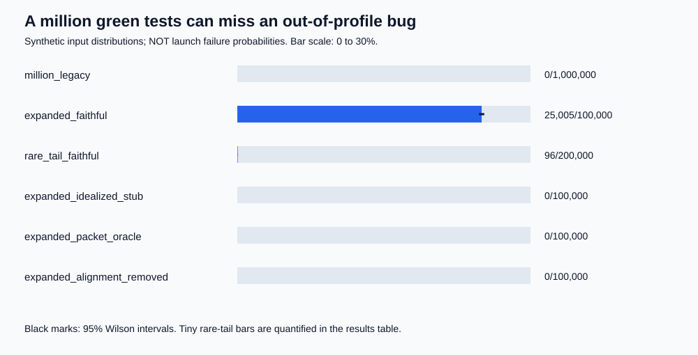

# The 37-Second Blind Spot

## A Million Green Tests, One Missing Assumption

**An Ethical Tech CoLab study of Ariane 501, Monte Carlo testing, and the limits of AI evaluations.**

**[Explore the research website and interactive lab](https://ethical-tech-colab.github.io/ariane-501-blind-spot-lab/)**

Overview / full research / hands-on demo / [AI usage disclosure](docs/AI_USAGE.md).

Inspired by [Channi Greenwall's article](https://www.linkedin.com/pulse/ten-years-flawless-flights-proved-nothing-software-ariane-greenwall-sc5he/). Independent analysis; no affiliation with or endorsement by the author, ESA, CNES, or NIST is implied.

> More tests cannot discover a failure your test world excludes.

### The verdict

**The disaster was testable and preventable. Monte Carlo would not automatically have found it.**

The 1996 inquiry says representative ground testing would have exposed the mechanism, and post-flight simulations reproduced it. That is stronger evidence of detectability than our retrospective toy model. But the probability of discovery depends on the input distribution, execution path, simulator fidelity, and failure oracle. A million tests of the wrong world can all pass.

The **37 seconds** refers to time after the main-engine ignition command, not lift-off. The first SRI failed at H0 + 36.7 seconds, approximately 30 seconds after lift-off. Breakup followed around H0 + 39 seconds.

### What we actually ran

**1,600,000 seeded synthetic test opportunities**, signed-conversion boundary tests, a synthetic temporal trace, barrier ablations, and all **256** combinations of an eight-factor Boolean model:

| Experiment | Tests | Detected failures |
|---|---:|---:|
| Narrow, legacy-like input support | 1,000,000 | 0 |
| Expanded support, faithful mechanism model | 100,000 | 25,005 |
| Rare-tail support, faithful model | 200,000 | 96 |
| Expanded support, idealized SRI stub | 100,000 | 0 |
| Expanded support, packet-presence oracle | 100,000 | 0, despite 25,005 navigation losses |
| Expanded support, post-launch alignment removed | 100,000 | 0 |

These are **not measured Ariane 4/Ariane 5 trajectories or estimated launch failure rates**. Public sources establish the failure mechanism but do not give us the original flight executable, a calibrated BH transfer function, or a raw telemetry dataset. All invented values and distributions are labeled.



### Read the study

- [Detailed research and assertion-by-assertion verdict](docs/STUDY.md)
- [Methods, variables, and statistical limitations](docs/METHODS.md)
- [BLIND-SPOT teaching and evaluation framework](docs/FRAMEWORK.md)
- [Verified source catalog and research-access log](data/sources.json)
- [Variable provenance](data/variables.csv) and [executable assumption register](data/assumptions.json)
- [Generated results](results/summary.md), [machine-readable results](results/study.json), and [CSV](results/monte_carlo.csv)
- [Narrative notebook](study.ipynb)

### Reproduce locally

Python **3.11 or newer**. The core model, simulation, charts, and tests use only the standard library; no API key, cloud account, or network access is needed.

PowerShell:

```powershell
python -m venv .venv
.\.venv\Scripts\python.exe -m unittest discover -s tests -v
.\.venv\Scripts\python.exe -m blind_spot.run
.\.venv\Scripts\python.exe -m blind_spot.run --check
```

`--check` reruns all experiments and compares seven generated artifacts byte-for-byte without overwriting them. Computed probabilities and interval bounds are published at 12 significant digits to avoid platform-specific last-bit noise; counts are exact. The full run takes seconds to tens of seconds, depending on the machine. Keep the seeds fixed to reproduce these exact counts.

To see an actual red/green safety evaluation rather than a simulation counter:

```powershell
.\.venv\Scripts\python.exe -m blind_spot.check_contract --design baseline
# Expected: exit code 1; two boundary cases violate the navigation contract.
.\.venv\Scripts\python.exe -m blind_spot.check_contract --design alignment-removed
# Expected: exit code 0; all four modeled contract cases pass.
```

The passing intervention blocks this modeled chain, not every possible failure.

Optional notebook:

```powershell
.\.venv\Scripts\python.exe -m pip install -r requirements.txt
.\.venv\Scripts\python.exe tools\execute_notebook.py
```

Open [study.ipynb](study.ipynb) in VS Code, select the local `.venv` kernel, and use **Run All** to explore it yourself. Each code cell is followed by an interpretation. The notebook recomputes the study and asserts that the published results match. The execution helper validates and persists outputs.

[requirements.lock.txt](requirements.lock.txt) records the resolved Windows/Python 3.12 notebook environment; use [requirements.txt](requirements.txt) for cross-platform installation. CI uses the portable requirements and reruns the calculations.

### What this project is not

- Not recovered Ada source, a digital twin, flight certification, or engineering guidance for controlling a launcher.
- Not proof that an AI system would have discovered the problem without hindsight.
- Not an exhaustive search of all possible real-world variables.
- Not a claim that a passing model is a safe system.

The remedies in the model are **illustrative causal interventions**, not qualified spacecraft fixes. Rejecting diagnostics, for example, prevents the modeled unsafe command but does not restore navigation.

### Website development and GitHub Pages

The [static website](site/) has no external browser runtime dependencies. Node.js **22 or newer** is needed only for building, testing, and the local preview. Its isolated [package manifest](site/package.json) and lock file do not change the Python environment.

From the repository root, in PowerShell or a Linux shell:

```powershell
npm ci --prefix site
npm run build --prefix site
npm test --prefix site
npm run preview --prefix site
```

Open <http://127.0.0.1:4173/ariane-501-blind-spot-lab/>. The preview deliberately uses the same project subpath as Pages. Stop it with Ctrl+C. Rebuild after editing source content; the preview is not a watcher.

The build renders the complete study, methods, framework, results summary, and AI disclosure from their authoritative Markdown. It reads numerical findings from [results/study.json](results/study.json), renders the source/assumption registers, and copies the published data and SVG charts into ignored `site/dist/`. It does **not** rerun the simulation, alter generated research results, or need a cloud/API key. Do not edit or commit the generated site directory.

The JavaScript demo ports the mechanism's conversion, lifecycle, common-mode failure, barriers, and oracle semantics. Its tests check signed boundaries (including adjacent floating-point values), all 65,536 signed integers, every published barrier ablation, the 256-configuration grid totals, and analytical probability tables against the existing Python result artifact. These checks do not establish historical fidelity. Browser snapshots reset the system for each input; they are not a temporal recovery model. The probability explorer uses analytic formulas, not a browser PRNG or a replay of Python's seeded draws.

[Research website workflow](.github/workflows/pages.yml) is separate from [simulation reproduction](.github/workflows/reproduce.yml). In repository **Settings > Pages > Build and deployment**, set **Source: GitHub Actions**. Ensure Actions are enabled and the `github-pages` environment permits deployments from `main`. Push website/research changes to `main`, or run **Research website > Run workflow** on `main`. Pull requests build and test without deploying. The workflow uploads only `site/dist/` and deploys that artifact; it does not use the root `/docs` Pages source.

The site's evidence-first [AI disclosure](docs/AI_USAGE.md) cites the actual CoLab `usage-calc` methodology and distinguishes user direction, AI assistance, and unknown usage quantities. No usage totals or model identifiers are fabricated.

### Research tooling

Tavily search and extraction were attempted, but the configured key was rejected. A key update was requested; research continued using other web search and direct page retrieval. No Tavily-assisted findings are claimed. Direct ESA pages returned HTTP 403; the inquiry was read through a university-hosted copy, with independent CNES material for the Ariane 4 chronology. See the [access log](data/sources.json).

### Reuse

Original project code and writing are released under the [MIT License](LICENSE). External articles and reports remain with their respective rights holders and are linked, not redistributed. Please preserve the synthetic-data and hindsight limitations when sharing results.
