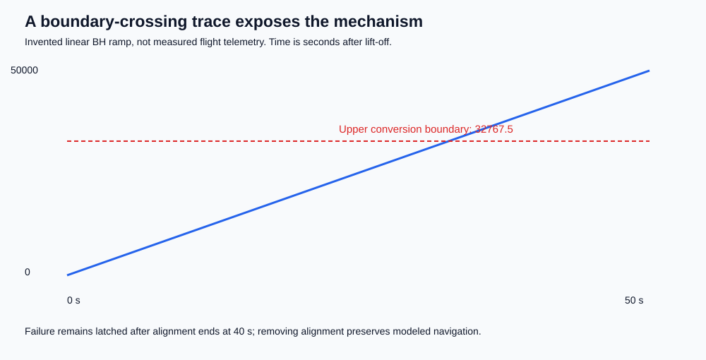

# Methods and model card

## Scope

This is a retrospective, mechanism-level teaching experiment. We knew the failure mechanism before selecting the model and distributions. It is not preregistered, a blind discovery test, an empirical launch-risk study, or a digital twin.

The simulator's outcome is **modeled navigation loss and/or an unsafe-command proxy**, not a physical breakup calculation. It has no aerodynamics, actual nozzle commands, guidance law, original diagnostic encodings, or original BH filter.

## Data provenance and missingness

[variables.csv](../data/variables.csv) separates documented facts, derived mathematics, invented experiment inputs, and unavailable historical quantities. Empty historical values mean unavailable, not zero. No missing telemetry is imputed.

The experiment generates complete finite input records. The model rejects nonfinite values, invalid times, invalid replica counts, and unknown profiles/oracles explicitly. Repeated Monte Carlo draws are permitted, not deduplicated; repetition belongs to iid sampling. The Boolean grid is checked to contain 256 unique rows. There is no supervised learning, fitting, training/test split, or normalization fitted to data.

## Conversion convention

The model converts a Python float to the nearest integer, with halfway values rounded away from zero, then checks the signed 16-bit range `[-32768, 32767]`. This follows the real-to-integer convention described in Ada RM 4.6. Python's default bankers' `round` would be inappropriate for that convention.

- `32767.49` rounds to 32767 and succeeds.
- `32767.5` rounds to 32768 and fails.
- `-32768.49` rounds to -32768 and succeeds.
- `-32768.5` rounds to -32769 and fails.

Tests include the immediately adjacent floating-point values and every representable signed 16-bit integer. The public inquiry does not provide the exact compiled instruction or complete subtype/scaling context, so this is **an illustrative Ada-style convention**, not a claimed bit-exact reconstruction. Integer-valued overflow examples remain overflow examples without relying on a half-unit rounding edge.

## State and causal structure

`time_s` is elapsed time after lift-off. For a retained alignment function, a conversion opportunity is active while `time_s < alignment_end_s`. The experiment fixes the latter to 40 seconds, a simplified form of the inquiry's approximately 40-second interval.

An out-of-range conversion in the implementation raises the modeled alignment exception unless explicitly guarded. Without exception isolation, all identical SRI replicas halt. Without diagnostic validation, the modeled diagnostic frame is accepted as flight information and produces an unsafe-command proxy.

The strong safety oracle flags missing navigation **or** an unsafe command. The deliberately weak oracle checks only whether a bus frame exists. Diagnostic frames therefore look like success to the weak oracle.

Removing post-launch alignment and guarding/isolating its conversion are separate modeled barriers. They are not certified repairs. In particular, the guard reports out-of-range status; it does not silently clamp BH and pretend navigation is correct.

An idealized SRI stub bypasses the failing code and returns nominal navigation. That is an intentionally inadequate **test harness**, not an improved implementation.

## Monte Carlo design

Every trial resets the toy system. It is one conversion opportunity, not a full trajectory or a full mission. BH and time are independent by construction; this is useful for demonstrating coverage but physically unrealistic.

| Profile | Synthetic BH distribution (conversion units) | Time distribution | Analytic detection p with default design |
|---|---|---|---:|
| legacy | Uniform [0, 30000] | Uniform [0, 80] seconds | 0 |
| expanded | Uniform [0, 65535] | Uniform [0, 80] seconds | 0.25 |
| rare_tail | 99.9% Uniform [0, 30000]; 0.1% Uniform [32768, 65535] | Uniform [0, 80] seconds | 0.0005 |

The expanded upper-conversion boundary is exactly the midpoint 32767.5; half the BH distribution overflows and half the times activate alignment. Thus `p = 1/2 * 1/2 = 1/4`. For the rare tail, `p = 0.001 * 1/2`.

These analytic values use ideal continuous distributions. Python's finite pseudorandom grid has negligible endpoint effects at these sample sizes. Boundary correctness is covered separately by deterministic tests rather than hoped for in random sampling.

No claim is made that historical BH was uniformly distributed, that time and BH were independent, or that Ariane 5's real failure was a rare stochastic fault. Conditional on the flown implementation and input history, the failure was systematic.

Seeds begin at 5011996. Matched expanded runs use the same seed and draw function. [study.json](../results/study.json) stores seeds, trial counts, settings, and counts; [monte_carlo.csv](../results/monte_carlo.csv) provides a flat table. Individual Monte Carlo draws are regenerated from seed rather than stored as a misleading telemetry dataset.

## Temporal demonstration

[synthetic_trace.csv](../results/synthetic_trace.csv) uses:

- `BH(t) = 50000 * t / 50`
- `t = 0, 0.1, ..., 50` seconds after lift-off
- alignment end at 40 seconds
- latched navigation loss once the modeled processor has halted.

It first crosses the upper conversion boundary at the sampled time 32.8 seconds. **This is not the historical 30-second failure time** and was not fitted to it. The default trace helper also supports a 72 ms step, inspired by the report's data-cycle period, but that is not the SRI's complete internal scheduler. No sub-cycle ordering between replicas is reconstructed.

## Statistical inference

We report two-sided 95% Wilson intervals for observed detection proportions and an exact one-sided 95% upper binomial bound when detections equal zero:

`upper = 1 - 0.05^(1/n)`.

The approximately `3/n` shortcut is not used for computation. These intervals describe binomial sampling uncertainty, not uncertainty about the model's validity, omitted variables, or real-world deployment.

Under iid opportunities, detection by budget is `1 - (1-p)^n`. Solving for `n` yields:

`ceil(log(0.05) / log(1-p))`.

At `p=0` there is no finite budget; at `p=1` one test suffices. Stable `log1p` and `expm1` calculations avoid unnecessary numerical cancellation.

This is a demonstration, not hypothesis-test p-value fishing. We compare sample rates to independently derived probabilities and test implementation invariants. We do not infer a historical disaster probability from synthetic frequencies.

## Finite multivariate design

The eight Boolean factors form a full factorial 256-row design:

1. BH 20000 or 40000.
2. Time 50 or 20 seconds.
3. Retained alignment.
4. Conversion guard.
5. Alignment exception isolation.
6. Diagnostic validation.
7. Implementation in the test loop.
8. Safety rather than packet oracle.

Full pairwise coverage means all `C(8,2) * 4 = 112` value pairs. A deterministic greedy algorithm generates one covering suite. A second suite uses only non-navigation-loss candidates but must still cover the **same full pair universe**. The tests verify this constructively, rather than merely trusting a reported coverage percentage.

Navigation loss in this design requires six simultaneous factor settings; oracle detection adds another. This is a pedagogical consequence of the design/harness dimensions, not a historical estimate of interaction order.

No pairwise method, sample size, or finite full-factorial grid can prove completeness over unspecified variables, continuous values, arbitrary event sequences, or an incorrect model.

## Reproducibility and verification

- Unit tests: conversion boundaries, all 65,536 representable integers, phase boundary, redundant common-mode failure, fault containment, diagnostic handling, probability formulas, invalid inputs, and actual pair coverage.
- Release-style contract: `python -m blind_spot.check_contract --design baseline` exits 1 for two boundary violations; `--design alignment-removed` exits 0. The test suite verifies these expected contrasting outcomes.
- Result verification: recompute and byte-compare all seven generated artifacts.
- Artifact checks: analytic rates versus observed counts, matched input counts, scenario completeness, source/assumption traceability, parseable SVG/CSV/JSON, and notebook structure.
- Notebook: recomputes the study, compares with published results, displays figures and interprets each code cell.
- CI: repeats tests, result verification, and notebook execution on Python 3.12.

The Windows lock file captures the original optional notebook environment. The simulation itself uses no third-party numerical libraries. Floating-point/libm and pseudorandom behavior can differ across runtimes; CI checks the chosen runtime rather than assuming all language implementations are bit-identical.
