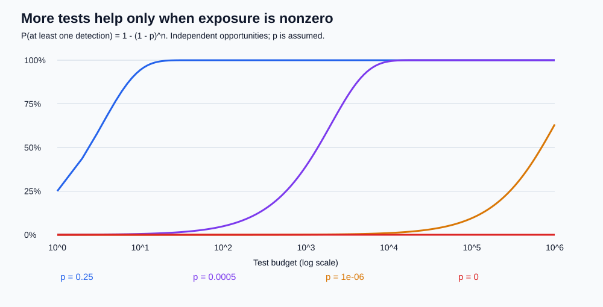
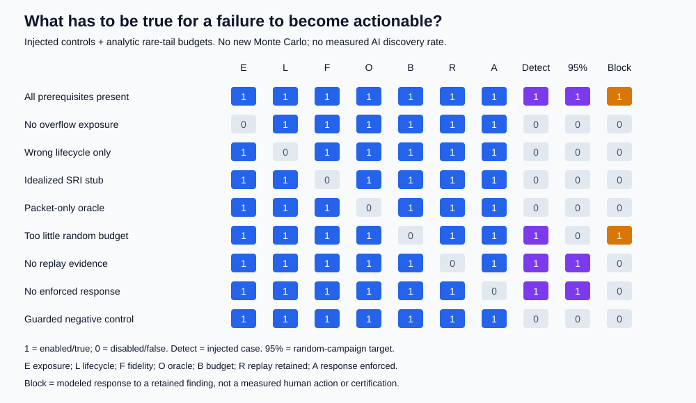

# The 37-Second Blind Spot

## A Million Green Tests, One Missing Assumption

**Research date:** 4 October 2026

**Study type:** retrospective documentary analysis and synthetic mechanism experiment

**Organization:** Ethical Tech CoLab

## Executive finding

**Hypothesis:** representative simulation and AI-assisted test design could uncover an Ariane 501-like failure before deployment.

We assess that hypothesis in four parts, separating detectability from an unconditional discovery guarantee:

1. **Supported:** Ariane 501 was a testable, avoidable systems-engineering failure. The inquiry explicitly identifies feasible tests that would have exposed it.
2. **Conditionally supported:** Monte Carlo can find this class of failure quickly when its input support reaches the dangerous region, the relevant code actually executes, and the oracle recognizes the failure.
3. **Refuted as a general guarantee:** sampling many combinations does not discover assumptions excluded from the model, missing code paths, or failures the oracle calls success.
4. **Not established:** the probability that contemporary AI engineering or evaluation practices would independently have discovered it. Neither the historical record nor this hindsight-informed experiment estimates that quantity.

The stronger formulation is:

> Ariane 501 shows why representative executable contracts and integration tests matter more than the number of passing evaluations. Monte Carlo becomes powerful after we challenge the boundaries of the test world.

## 1. What the inquiry establishes

The most important evidence is the **19 July 1996 Inquiry Board report**, chaired by J. L. Lions, read in a [University of Minnesota-hosted copy][S2]. It distinguishes the causal chain from the specification, review, and test decisions that allowed it.

### Chronology: do not mix the clocks

| Event | Inquiry timing | Interpretation |
|---|---|---|
| Main-engine ignition command | H0 | Reference event, not lift-off |
| Backup SRI becomes inoperative | H0 + 36.7 s | Approximately 30 s after lift-off |
| Active SRI fails for the same reason | Approximately 0.05 s later | Backup had failed during the preceding data cycle |
| Launcher disintegrates | Approximately H0 + 39 s | Aerodynamic loads following erroneous steering |
| Destruction sequence | Upon disintegration | Automatic, as designed; not the initial cause |

The report gives a **72 ms data-cycle period** in section 2.1 and approximately **0.05 s** between failures in finding 3.1(f). Those are different statements; they should not be silently equated. Some popular summaries also reverse the order of the two SRI failures.

### The failure chain

1. A pre-flight alignment function continued to execute after lift-off. It no longer produced useful alignment results in flight.
2. A computed internal value, **BH (Horizontal Bias)**, related to sensed horizontal velocity, grew beyond the intended conversion range.
3. An unprotected conversion from a **64-bit floating-point value to a signed 16-bit integer** generated an Operand Error.
4. The exception policy required the SRI processor to stop. This disabled essential navigation along with the unnecessary alignment task.
5. The backup and active SRIs shared hardware and software. Both suffered the same systematic error; redundancy was not independent protection.
6. Diagnostic information from the active SRI was interpreted by the main computer as flight data.
7. The resulting steering commands produced large nozzle deflections and destructive aerodynamic loads.

This is not adequately described as either "just an overflow" or "not a software bug." The report attributes the loss to **specification and design errors in SRI software**, embedded in a broader systems-engineering failure [S2, sections 2.1-2.3 and 3.2].

### Why the code remained

An earlier Ariane requirement allowed continued alignment to support recovery from a late countdown hold without waiting approximately 45 minutes for normal realignment. The report says this capability was used once, on Flight 33 in 1989. It was retained for commonality even though Ariane 5's preparation sequence did not require it.

Alignment operated for 50 seconds after SRI Flight Mode began. For Ariane 5 that mode began at H0 - 3 seconds; the report describes continued alignment for approximately 40 seconds after lift-off. We model a 40-second post-lift-off interval, not a precisely reconstructed schedule.

### The omitted assumption

Of seven conversions identified as potentially vulnerable, four were protected. Three, including BH, were not. The rationale was physical limitation or an assumed safety margin; a maximum processor workload target of 80% was cited. The inquiry found no evidence that trajectory data had been used to analyze the unprotected variables. Ariane 5 trajectory data were explicitly excluded from the SRI requirements and specification.

The inquiry reports that Ariane 5's trajectory built horizontal velocity roughly five times more rapidly than Ariane 4's. This is **not** a published calibration stating `BH = 5 * Ariane4_BH`, nor does it give an overflow speed in metres per second. BH is an alignment-result variable, not interchangeable with physical horizontal velocity.

## 2. Assessing the article fairly

[Channi Greenwall's article][S1] is compelling on the central point: reuse carried over code without adequately exposing the environmental assumptions needed to justify it. Its discussion of obscured rationale, selective protection, and the mismatch between Ariane 4 and Ariane 5 is well grounded in the inquiry.

Three qualifications make the teaching argument stronger:

- **"Ten years" is not a literal decade of Ariane 4 flights before this failure.** CNES dates the first Ariane 4 launch to 15 June 1988 [S3]; Ariane 501 failed on 4 June 1996. The inquiry dates the earlier alignment requirement to more than ten years earlier. Requirement age and Ariane 4 flight history are different.
- **"Proved nothing" should mean no proof of safety in the expanded Ariane 5 operating envelope.** Successful flights still supply evidence about conditions actually encountered. They cannot establish a universal range claim outside those conditions.
- **"Not a software bug" is useful rhetoric against an oversimplified story, not the inquiry's technical classification.** The report identifies software specification and design errors as causal.

The article's claim about a flawless history should not be expanded to "all Ariane 4 missions succeeded." Nor can this study independently verify the service history of every revision of the particular SRI software.

## 3. The strongest answer to "would tests have caught it?"

The answer is already partly in the historical record:

- **Section 2.3:** ground testing could inject simulated accelerometer signals based on predicted flight parameters, with a turntable for angular motion. The Board says such testing would have exposed the mechanism.
- **Finding 3.1(s):** including the SRI itself, or a detailed simulation, in overall system simulations could have detected the failure.
- **Finding 3.1(t):** post-flight simulations using the SRI software and actual trajectory data faithfully reproduced the events.

The program had extensive tests and closed-loop simulations. Many physical units were in the loop, but the two SRIs were represented by software modules producing simulated outputs. Electrical and bus-level integration tests with actual units were not equivalent to exercising the implementation against the new flight conditions.

The report discusses real difficulties: generating accurate signals, differing time steps, and simulating failure modes. It does not support a caricature that nobody tested anything, or that comprehensive qualification would have been effortless.

**A representative deterministic replay was sufficient for the known failure. Monte Carlo was not necessary.** Boundary-value analysis, static range reasoning, phase/lifecycle checks, and hardware/software-in-the-loop integration could also have contributed. We cannot retrospectively assign a numerical pre-flight probability of discovery from the public documents.

## 4. What can actually be simulated from public information?

We have enough for a **mechanism-level demonstrator**, but not an independently validated reproduction of the mission.

Known: integer width, conversion failure, alignment phase, shared software, processor-halt response, diagnostic misuse, broad timing, and the testing gap.

Not obtained in the reviewed sources: the original executable/source tree, exact BH filter and scaling, raw time-series inputs and sensor noise distributions, exact diagnostic word encoding, or the full integrated dynamics/control model.

The lab therefore uses invented BH inputs in **conversion units**, with no physical-speed interpretation. Unknown historical quantities remain unknown; they are not filled with plausible-looking telemetry. See [variable provenance](../data/variables.csv) and [methods](METHODS.md).

## 5. The Monte Carlo results

We ran **1,600,000 synthetic test opportunities** with fixed seeds. A trial represents one independently sampled opportunity to execute the conversion, not one whole launch.

| Test world | Detected / trials | What it demonstrates |
|---|---:|---|
| Legacy-like BH support below the limit | 0 / 1,000,000 | More samples cannot cross an excluded boundary |
| Expanded support, faithful mechanism and safety oracle | 25,005 / 100,000 | The known defect is easy to expose when the trigger is common |
| Rare overflow tail, faithful mechanism and oracle | 96 / 200,000 | Detection becomes budget-sensitive when exposure is rare |
| Expanded support, idealized SRI stub | 0 / 100,000 | A simulator can erase the implementation defect |
| Expanded support, packet-presence oracle | 0 / 100,000 | All tests pass despite 25,005 modeled navigation losses |
| Expanded support, alignment removed | 0 / 100,000 | An explicit design change blocks this particular chain |

The four expanded-support experiments use **identical random inputs**. That paired design isolates the effect of harness, oracle, and removal changes from random sampling variation.

The expanded faithful rate is **25.005%**, with a 95% Wilson interval of approximately **[24.738%, 25.274%]**. The rare-tail rate is **0.048%**, interval **[0.0393%, 0.0586%]**. These agree with the analytically defined synthetic probabilities of 25% and 0.05%. They are not measurements of Ariane's reliability.

### A falsifiable mathematical statement

Let `p` be the probability that an independent test both exercises a failure and detects it. Then:

`P(at least one detection in n tests) = 1 - (1 - p)^n`.

| Assumed p | Tests needed for at least 95% discovery probability |
|---:|---:|
| 0 | No finite number |
| 0.000001 | 2,995,731 |
| 0.0005 | 5,990 |
| 0.01 | 299 |
| 0.25 | 11 |

If the generating distribution has no support in the triggering region, `p = 0`. This is a constructive refutation of the **unconditional** claim that enough Monte Carlo tests must find the defect.

Zero failures in a million iid tests gives an exact one-sided 95% upper bound of about **2.996 per million** under that particular distribution and a reliable oracle. It is neither a 95% posterior probability that the system is safe nor a bound valid after distribution shift. With a blind oracle, it bounds observed detections, not actual failures.

## 6. Multivariate coverage and misleading green dashboards

The finite Boolean study crosses eight factors: high/low BH, early/late evaluation, retained alignment, conversion guard, exception isolation, diagnostic validation, implementation fidelity, and oracle strength.

All **256 configurations** are executed. Four lose navigation; two are detected by their selected oracle. Both an ordinary deterministic greedy pairwise suite and an intentionally constructed non-failing pairwise witness cover **all 112 possible factor pairs** using eight cases, yet miss every navigation loss.

This is not a claim that pairwise testing is ineffective. The second suite is deliberately adversarial, and the first depends on ordering. It demonstrates that pairwise coverage is **not a guarantee** for higher-order interactions. NIST's work supports efficient interaction testing, not universal completeness for arbitrary software [S5, S6].

Importantly, this high-order structure partly comes from crossing **design and harness switches**. In the historical configuration, those switches were fixed; an overflow during active alignment was enough to expose the defect. We do not claim the original accident required an eight-dimensional random search.

Adding a second or third **identical** SRI does not reduce deterministic common-mode failure in this model. Rejecting diagnostics blocks the unsafe-command proxy but leaves navigation unavailable. A good oracle must distinguish "no bad command emitted" from "required service still available."

## 7. What this says about AI evals

The documented flight failure did not depend on an AI model. The inquiry describes conventional software and systems-engineering causes; it is not an audit proving that no AI-related technique was used anywhere in development.

The analogy to AI is strong:

| Ariane issue | AI-engineered-system analogue |
|---|---|
| Ariane 4 trajectory assumptions reused | Training or benchmark distribution treated as deployment reality |
| Alignment treated as harmless after launch | Background agent task or tool integration treated as noncritical |
| Identical SRI failure | Shared model, prompt, dependency, or evaluator creates correlated failure |
| Diagnostic data accepted as flight data | Error text or malformed tool output accepted as valid task output |
| Simulated SRI replaces implementation | Mocked tools, idealized users, or simplified environments hide defects |
| Success on the old envelope | Aggregate benchmark pass rate mistaken for assurance under shift |

NIST AI RMF emphasizes intended-use validity, realistic test sets, context, robustness, and continued monitoring [S7]. It is voluntary guidance, not a guarantee that an evaluation program satisfies those conditions.

AI can help extract assumptions, propose adversarial cases, generate tests, and review interfaces. It can also reproduce the designers' assumptions or generate an oracle that agrees with faulty code. On a famous case, an assistant may recall the published answer rather than independently discover it.

**No blinded AI-discovery experiment was run here.** The assistant's production of this retrospective lab is not evidence that AI would have prevented the 1996 accident.

### A defensible future experiment

Use unseen, renamed system variants with planted and absent faults, independent hidden oracles, and controlled budgets. Randomly assign human-only, AI-assisted, and conventional-tool-assisted conditions. Hold back the fault description, trajectory boundary, and selected mutations from test designers. Record model/version, tools, prompts, time, input support, false alarms, discovered mechanisms, and downstream mitigation quality.

Preregister the primary outcome and stopping rule before running the comparison. Report detection rates with uncertainty and cluster by scenario and evaluator; repeated generations on the same case are not independent real-world discoveries. Include negative cases to penalize declaring every system unsafe. The [framework](FRAMEWORK.md) provides an exercise protocol, not fabricated results.

## 8. What would have to be true for this failure mode to be uncovered?

For a dynamic test to uncover this mechanism, its world must contain a falsifier and preserve that falsifier from input to evaluation. For a finding to change a release decision, evidence and response must also survive. Those are separate obligations, not a single green/red score.

| Prerequisite | Concrete falsifier or control | What its absence means | Transfer to future AI testing |
|---|---|---|---|
| Exposure to the dangerous input | Inject BH 40000; compare BH 20000 and legacy-like support | The sampled world excludes the boundary | Include schema violations, distribution shifts, and adversarial tool responses; document unsupported regions |
| Reachable lifecycle | Replay at 20 s versus 50 s after lift-off | The input never reaches the vulnerable function while active | Exercise startup, tool-call, retry, timeout, and state-transition paths, not just steady-state prompts |
| Relevant executable semantics | Run the conversion/exception logic versus the nominal-output stub | The harness erases the defect | Test actual parsers, tools, permissions, shared dependencies, and state, not only mocks |
| Observability and a valid oracle | Score navigation availability versus packet presence | A visible artifact is mistaken for successful service | Check semantic task completion and authorization, not merely an HTTP 200 or fluent response |
| A sufficient budget for the stated target | Compare 10 with the minimal 5,990 iid tests at synthetic `p=0.0005` | Discovery is possible but the 95% target is unmet | Preregister budgets and stopping rules; justify tail probabilities rather than borrow benchmark pass rates |
| Actionable evidence and response | Retain input/configuration/oracle for replay; apply a blocking contract | A detection can remain an unrepeatable alert or an ignored finding | Save a minimal regression case, assign an owner, block or explicitly adjudicate release, then retest |

### Controlled prerequisite removals

The existing experiments already separate input support, harness fidelity, and oracle quality. In particular, the matched expanded runs retain exactly the same inputs: a packet oracle hides 25,005 navigation losses, while a stub never executes the failing semantics. The rare-tail run supplies a declared synthetic distribution, not a measured historical tail estimate.

We extend that evidence with a deterministic **128-row, seven-switch prerequisite grid**. The first four switches select overflow exposure, reachable alignment, faithful implementation, and the safety oracle. The last three select an adequate rare-event budget, retention of a replay record, and enforcement of a modeled response policy. Each row evaluates an injected witness using the existing model and separately computes the random-campaign probability. It does not run another Monte Carlo sample.

One control enables every prerequisite. Seven controls remove exactly one prerequisite at a time. A final **guarded negative control** retains all test prerequisites but guards the conversion: it must not trigger the navigation-loss oracle. The generated [control table and complete results](../results/summary.md#detection-prerequisites-controlled-removals) expose the actual model outcome separately from what the harness detects.

Across the designed grid there are 32 actual navigation losses, 8 detected injected witnesses, 4 retained replayable findings, and 2 modeled response blocks. Four configurations meet the conditional 95% discovery target; one also retains evidence and enables the response policy. **These are truth-table counts, not an empirical readiness score, an AI success rate, or a historical probability.**

The missing-budget control still detects the injected witness and blocks under the modeled response policy. Its separate 10-test random campaign has only about **0.499%** discovery probability at `p=0.0005`, versus at least 95% at 5,990 tests. Missing replay or response does not reduce the detection probability; it breaks the route from finding to an actionable decision.

### Necessary is not sufficient, and sufficient is conditional

- **For the specified vulnerable design and injected dynamic witness**, exposure, reachable lifecycle, faithful semantics, and the safety oracle are each necessary; together they are sufficient for detection. Static analysis, formal reasoning, or source review may discover a related defect without executing this route.
- **For random discovery**, positive joint exposure and a capable harness/oracle make detection possible, not certain. The relevant quantity is their joint detection probability, not a product of marginal rates unless independence is justified. No finite random budget guarantees discovery when `0 < p < 1`.
- **For the declared 95% target**, a justified `p` and a large-enough iid budget are sufficient within that probability model. Budget is not necessary for a lucky first detection, and unknown real-world `p` cannot be replaced with the toy value.
- **For the modeled response chain**, a detected, retained replay case and an enabled blocking policy are sufficient by construction. Actual understanding, ownership, escalation, and organizational action require independent evidence. None was measured here.

The [methods](METHODS.md#detection-readiness-experiment) give exact equations and control settings. The [future-testing guide](FRAMEWORK.md#design-a-detection-readiness-experiment) turns them into a protocol with negative controls, evidence requirements, response obligations, and explicit unknowns.

## 9. Bottom line for the hypothesis

**Keep:** the demand for falsifiable assumptions, realistic simulation, and aggressive multivariate testing.

**Change:** "this would easily have been found" to "**this could have been found with tests that exercised the actual implementation under the new flight conditions; Monte Carlo helps only if those conditions and a meaningful oracle are included**."

The unknown blind spot is not solved by unlimited randomness. It is reduced by making assumptions explicit, challenging model boundaries, testing integration and failure behavior, bringing in independent perspectives, and carrying unresolved uncertainty into release decisions.

The inquiry's recommendations already point in this direction: disable unnecessary flight functions, include real equipment and realistic inputs, identify implicit assumptions, include trajectory data in requirements, and treat justifications with the same care as code [S2, R1-R5, R9-R12].

---

## Sources and research limitations

[Machine-readable catalog and access status](../data/sources.json). This document paraphrases findings and links to sources; it does not redistribute their full text.

- **S1:** Channi Greenwall, LinkedIn article supplied by the user. Read directly; publication date not established in the retrieved body.
- **S2:** Ariane 5 Flight 501 Failure: Report by the Inquiry Board, 19 July 1996. Primary document accessed via a university mirror. The report refers to a separate technical report; it was not obtained for this study.
- **S3:** CNES, Ariane 1 to 4 launch facilities: first Ariane 4 launch chronology.
- **S4:** Ada Reference Manual, section 4.6. Supports the illustrative conversion convention, not certification of the flown compiler's exact implementation.
- **S5-S6:** NIST combinatorial-testing project and SP 800-142.
- **S7:** NIST AI RMF 1.0, trustworthiness characteristics.

Alternative web search located candidate documents; factual claims were checked against directly retrieved source text rather than accepted from search-generated summaries. ESA-hosted pages returned HTTP 403, so the inquiry was read through its university mirror and chronology checked independently at CNES. Source records distinguish direct reading, metadata-only verification, and material not obtained. These limitations constrain the evidence available here, not the existence of the documents.

[S1]: https://www.linkedin.com/pulse/ten-years-flawless-flights-proved-nothing-software-ariane-greenwall-sc5he/
[S2]: https://www-users.cse.umn.edu/~arnold/disasters/ariane5rep.html
[S3]: https://centrespatialguyanais.cnes.fr/en/ariane-1-4
[S4]: https://www.adaic.org/resources/add_content/standards/12rm/html/RM-4-6.html
[S5]: https://csrc.nist.gov/Projects/Automated-Combinatorial-Testing-for-Software
[S6]: https://csrc.nist.gov/pubs/sp/800/142/final
[S7]: https://airc.nist.gov/airmf-resources/airmf/3-sec-characteristics/
